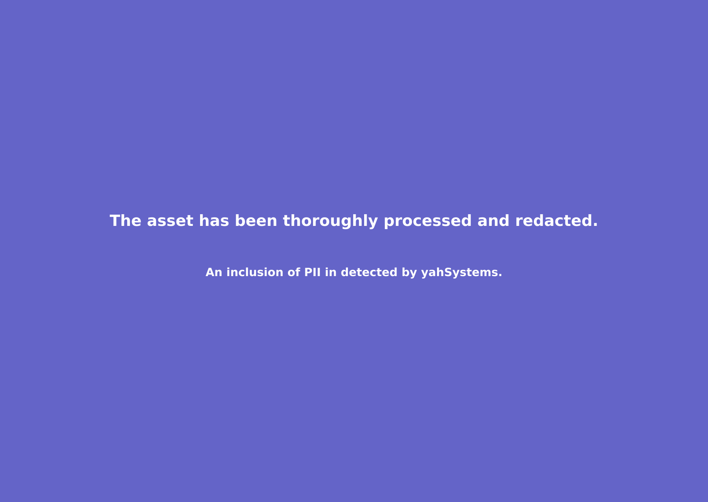

# yahdlp

Enterprise-grade PII detection and redaction tool. Automatically detect and redact sensitive information.


## Features

- 🔍 Accurate email and phone number detection
- 🛡️ Smart redaction system
- ✨ Visual confirmation overlays
- 🎯 Targeted redaction based on inspected values
- 🏢 Enterprise-ready processing

## Installation

```bash
npm install -g yahdlp
```

## Usage Guide

### PII Inspection

```bash
# Inspect for email
yahdlp inspect -t "dev@example.com" -e

# Inspect for phone number
yahdlp inspect -t "+1234567890" -p

# Inspect for both email and phone
yahdlp inspect -t "Email: dev@example.com Phone: +1234567890"
```

### Image Redaction Demo

Always inspect first, then redact:

```bash
# Demo No redaction workflow
yahdlp inspect -t "dev@example.com" -e
yahdlp redact yahAPPROACH.png output.png -e

No matching PII found
```


```bash
# Demo Yes redaction workflow
yahdlp inspect -t "dev@yahya-abulhaj.dev" -e
yahdlp redact yahAPPROACH.png output.png -e

Found and redacted PII
```




### Phone Numbers Considerations
```bash
# Phone redaction workflow
yahdlp inspect -t "+1234567890" -p
yahdlp redact input.png output.png -p

# Complete redaction workflow
yahdlp inspect -t "Email: dev@example.com Phone: +1234567890"
yahdlp redact input.png output.png
```


## How It Works

1. **Inspection Phase**
   - Analyzes provided text for PII patterns
   - Stores detected values securely for redaction

2. **Redaction Phase**
   - Scans image for matching PII
   - Applies enterprise-grade redaction
   - Adds visual confirmation overlay

## Output States

- **PII Found**: Full redaction with clear overlay
- **No PII Match**: Transparent overlay with notification

## Security Notes

- Only redacts when inspected PII matches image content
- Non-matching PII remains visible but marked as inspected
- No sensitive data stored between sessions

## Contributing

Contributions welcome! Please read our contributing guidelines first.

## License

MIT © 

## Author

Built with ❤️ - Crafting privacy-first solutions for a secure digital world.

